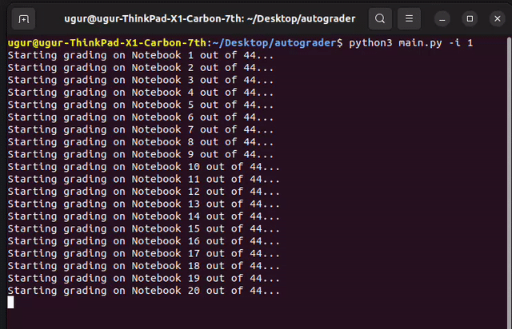

# Auto-grader

This is an automated grader that evaluates students' grades. As of now it is structured into 3 parts:

- Auto-downloader: Downloads specified submissions from all students who submitted as ZIP file and extracts it into the 'autograder' directory. Script: `adam.py`
- Auto-grader: Takes downloaded hand-ins (Jupyter Notebooks of students) and performs otter-grader checks; summarizes results into a spreadsheet. Scripts: `main.py`
- [WORK-IN-PROGRESS] Auto-publisher: Publishes auto-graded results onto ADAM as feedback for the students.

#### Contents
- 1. Setup and Virtual Environment

- 2. Structure
  - 2.1 Structure of Auto-downloader
  - 2.2 Structure of Auto-grader
    - 2.2.1 Database Branch
  - 2.3 Structure of Auto-publisher [WIP]

## 1. Setup and Virtual Environment
- Setup:
  - Clone repo, `cd autograder`

- Create and setup virtual environment:
  - Create virtual environment `python -m venv venv`
  - `source venv/bin/activate`
  - `pip3 install -r requirements.txt`
  - to quit virtual environment: `deactivate`

## 2. Structure
### 2.1 Structure of Auto-downloader
This is an automated downloader collecting a specific exercise from a specific coursesite on ADAM for all students that handed in something.

##### How To Run The Program

- Download specific exercise from specific course:
  - Optionally, start virtual environment:
    - `cd autograder`
    - `source venv/bin/activate`
  - `python3 adam.py -u USERNAME -p PASSWORD -n EXERCISENR`
    - optional args: coursesite, mode, ...; for help and list, see `python3 adam.py -h`
    - This script logs in and joins the default course page on ADAM and downloads all hand-ins from given exercise as zip file. It then unpacks and moves the hand-ins to the `autograder` directory as `autograder/EXERCISENAME/Abgaben/...`.

- To alter course and exercise infos for the download consult the TODOs in `adam.py`.

### 2.2 Structure of Auto-grader

The packages are:

- ``grader``
- `main.py`
- `analysis`
- `points parser`

- `xls`

##### How To Run The Program

- Download all Hand-Ins from Adam and Extract in the **working directory**

- Copy all the necessary tests from the `Insurance Week` or `Exercise Week` 

- Then the execution must the following:
  - `main.py -i numberofweek` **for insurance** If the program is done, it returns a 0
    - In the analysis directory, it creates a folder `Insurance_Analysis_numberofweek`
      - `Insurance_Analysis_numberofweek` folder has `Feedback_Insurance numberofweek` folder this contains the feedback.
        - the feedback is a `.txt` File it contains: If all tests passed, or which failed.
      - A `CSV` with the detailed analysis. `YYMMDD_CSV_Grades_Insurance_numberofweek`
      - A histogram with the statistics. 
      - The calculated result **as** `CSV`
      - The calculated result **as** `XLSX`
  - `main.py -e numberofweek` **for exercises** If the program is done, it returns a 0
    - In the analysis directory, it creates a folder `Exercise_Analysis_numberofweek`
      - `Exercise_Analysis_numberofweek` folder has a `Feedback_Exercise numberofweek`  which contains the feedback.
        - the feedback is a `.txt` File it contains: If all tests passed, or which failed.
      - A `CSV` with the detailed analysis. `YYMMDD_CSV_Grades_Exercise_numberofweek`
      - A histogram with the statistics. 
      - The calculated result **as** `CSV`
      - The calculated result **as** `XLSX`
  
  #### Running Program
  
  
  
  ### 2.2.1 Database branch
  
  To use the `database` branch please use the following command:
  
  ``` 
  git checkout database
  ```
  
  The execution is the same as [How to Run the Program](# How to Run the Program). The only difference is: It keeps track of the grading.
  
  This means in every  `email@stud.edu.com_feedback.txt` the file contains the following two lines.
  
  1. **For insurance**
     - You achieved in the insurance exam: `X` points.
       The total sum of your hand-in is: `X` of `Y` points.
  2. **For Exercise** 
     - You achieved in the Exercise `X, Y` points.
       The total sum of your hand-in is: `total of hand ins`, of `total exercise points` Points
  
   

### 2.3 Structure of Auto-publisher

[WIP]